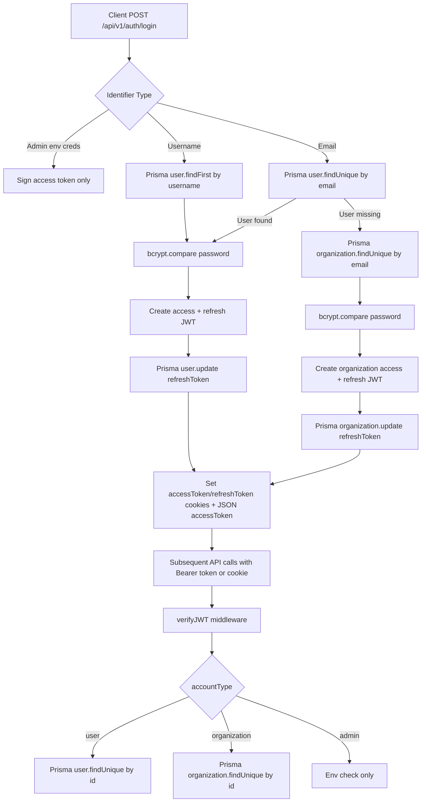

# ENUM Load Testing Analysis

## Scope
This document analyzes authentication and auth-adjacent request flow used by the load test suite.

## Authentication Routes Discovered
- `POST /api/v1/auth/login` (mounted from `backend/src/routes/unified-login.route.js`)
- `POST /api/v1/users/logout` (mounted from `backend/src/routes/user.route.js`)
- `GET /api/v1/users/profile` (mounted from `backend/src/routes/user.route.js`)
- OAuth routes (not targeted for RPS benchmarking):
  - `GET /api/auth/google`, `GET /api/auth/google/callback`
  - `GET /api/auth/github`, `GET /api/auth/github/callback`

## Authentication Flow Diagram

## Login Request Lifecycle
1. Input validation for `email|username` + `password`.
2. Prisma lookup (`user` first, then `organization` for email path).
3. Password verify with bcrypt (`bcrypt.compare`).
4. JWT signing (`jsonwebtoken.sign`) for access/refresh tokens.
5. Refresh token persisted to MongoDB via Prisma update.
6. Cookies set (`httpOnly`, env-dependent `sameSite`/`secure`) and JSON body returns `accessToken`.

## JWT Creation And Verification
- Login JWT creation uses `ACCESS_TOKEN_SECRET` and `REFRESH_TOKEN_SECRET` in unified login route.
- OAuth callback JWT creation uses `JWT_SECRET` in `generateToken` helper.
- Middleware verification accepts `[ACCESS_TOKEN_SECRET, JWT_SECRET]` in order.
- Implication: mixed secret usage is supported, but operationally raises key-management complexity.

## Password Hashing Strategy
- `bcrypt.hash(password, 10)` for registration.
- `bcrypt.compare` on login.
- Cost factor 10 is moderate and CPU-bound under heavy login concurrency.

## Prisma Queries During Login
- User username login: `user.findFirst({ where: { username } })`
- User email login: `user.findUnique({ where: { email } })`
- Organization email fallback: `organization.findUnique({ where: { email } })`
- Refresh token persistence: `user.update` or `organization.update`
- Response sanitization query: second `findUnique` with omitted secrets

## Redis And Rate Limiting Findings
- Redis is used in complexity subsystem (`backend/src/complexity/cache/redis.js`, `queue.js`).
- Login/auth flow currently does not perform Redis calls.
- Rate limiting exists for complexity analysis endpoint only (`10 req/min/user`); no dedicated login rate limiter discovered.
- Redis failures are mostly fail-open for complexity features.

## Request Lifecycle For Authenticated Journey Used In Tests
1. `POST /api/v1/auth/login`
2. `GET /api/v1/users/profile` (verify authenticated access path)
3. `GET /api/v1/simulations/getSimulations`
4. `GET /api/v1/simulations/getSimulation/:id`
5. `POST /api/v1/simulation-progress/:simulationId`
6. `POST /api/v1/users/logout`

## Potential Bottlenecks
- CPU: bcrypt compare/hash under high login throughput.
- DB write amplification: each login updates refresh token document.
- DB read amplification: profile fetch + simulation list/load + progress writes per user journey.
- Token verification path: extra Prisma lookup per protected request (`verifyJWT`).
- Serialization overhead: large simulation payloads and file-content responses can increase p95/p99.

## Performance Risks
- No auth-specific rate limiting can permit brute-force or burst traffic to hit bcrypt + DB heavily.
- Shared MongoDB cluster pressure from read-heavy and write-heavy routes during events.
- Token secret split (`JWT_SECRET` vs `ACCESS_TOKEN_SECRET`) can complicate incident handling/rotation.
- If Redis is unavailable, complexity subsystem degrades gracefully but may increase CPU load from uncached analysis.

## Notes For Load Test Safety
- Tests are explicitly gated by `LOAD_TEST_ENV=development`.
- Test framework defaults to localhost base URL unless overridden.
- No schema migrations, db push, or seed execution are performed by this framework.
